# 巡检问题修复

> An awesome project.

# 巡检工具使用说明 {docsify-ignore-all}
## 巡检工具下载地址
1. [windows](https://home.sunzhe.cc:89/d/windows-inspect.zip)
2. [linux](https://home.sunzhe.cc:89/d/Linux-inspect.tar.gz)

## 使用指南
### windows版本

`不支持windows 2008,只支持2012以上操作系统`

1. 将巡检工具放置在ecology同级目录下

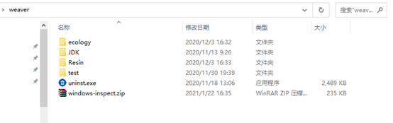

2. 解压巡检工具，并修改配置文件

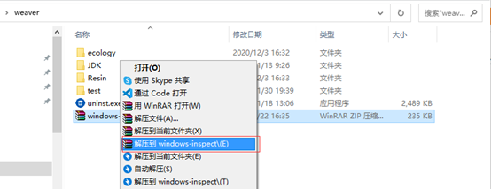

3.  配置文件说明如下

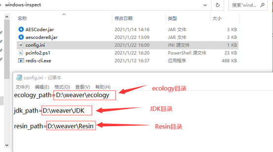

4.  配置完成开始运行start.bat如下：

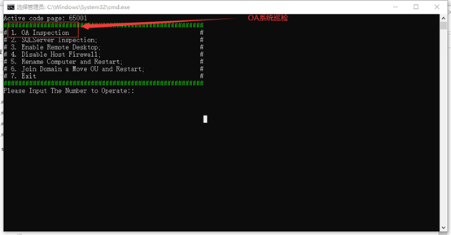

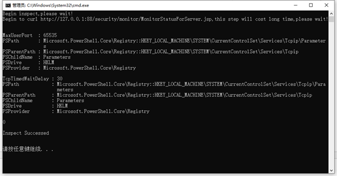

5. 运行完成后，会在本地weaver路径生成一个”客户名”_Windows2021-08-05-13-31_192.168.81.75_WEAVERZHE.json,请将本文件，附到巡检流程里面

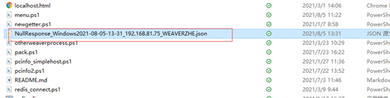

6. SQLserver巡检说明`注意一定要放置到SQLServer主机上,不能放置到OA主机上`

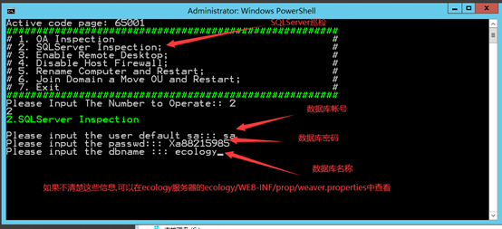


`因服务器负载和配置有差异，bat窗口的运行时间可能会长会短，请耐心等待，最长不超过5分钟，如果无响应请按回车键,oa巡检,请将巡检脚本放置到oa主机上,sqlserver巡检请将巡检脚本放置到sqlserver主机上`
  ### Linux版本

   `注意所有服务器都必须上传巡检脚本,然后根据主机角色选择对应的菜单,比如oracle主机,先上传巡检脚本,然后执行menu.sh,选择oracle巡检`
  #### OA巡检

  1. 上传巡检脚本到服务器,任意位置(建议/tmp),创建巡检目录并解压
  
  `mkdir inspect && tar -zxvf Linux-inspect.tar.gz -C inspect && cd inspect`

  2. 使用shell运行脚本 `sh menu.sh`,选择需要巡检的项目,暂时支持单主机巡检,OA巡检,EMP巡检(`EM7 不支持老EM,比如EM6,Ebridge,emessage等`),Redis巡检,Nginx巡检,Oracle巡检,MySQL巡检,单OA巡检(`适用于非Resin中间件,比如tomcat,东方通等`)
  
  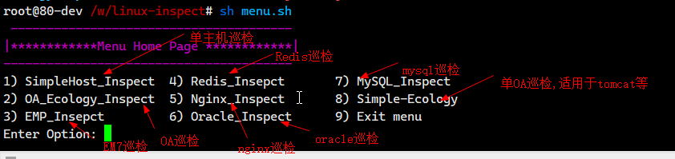

  3. 选择`2`,执行OA巡检,如下:
   
   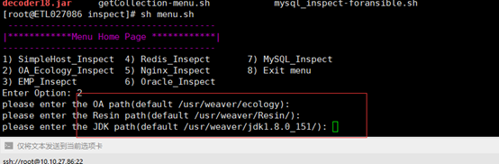

  `输入oa,resin,jdk路径,如果与default一致,回车即可`

  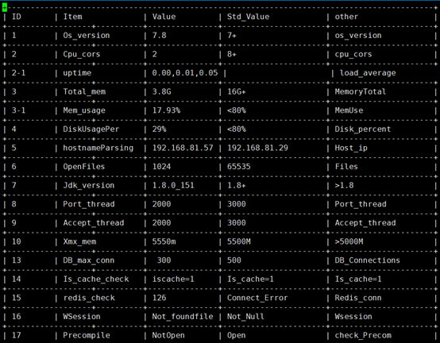

  4. 将文件附在巡检流程里面,文件名应为`客户名_Inspection-内网IP-时间.txt`,比如`中国交通信息科技集团有限公司_Inspection-10.100.3.2-202110121449.txt`
  
  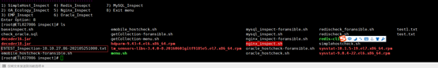

  #### EMP巡检

  `注意,EMP会自动巡检EMP所用Redis,MySQL,请勿重复执行巡检脚本,巡检redis,mysql`

  1. 上传巡检脚本到EMP服务器,任意位置(建议/tmp),创建巡检目录并解压
   
   `mkdir inspect && tar -zxvf Linux-inspect.tar.gz -C inspect && cd inspect`

  2. 执行`sh menu.sh`,选择`3`,执行EMP巡检,输入安装路径,默认为`/usr/emp`
  
  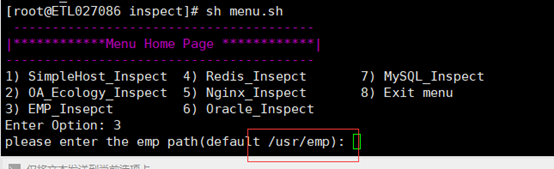

  #### Redis巡检

  1. 上传巡检脚本到Redis服务器,任意位置(建议/tmp),创建巡检目录并解压
   
   `mkdir inspect && tar -zxvf Linux-inspect.tar.gz -C inspect && cd inspect`

  2. 执行`sh menu.sh`,选择`4`,执行Redis巡检,输入Redis端口,密码
  
  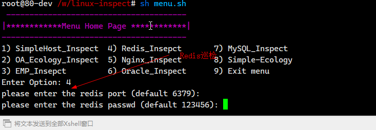

  #### Nginx巡检

   1. 上传巡检脚本到Nginx服务器,任意位置(建议/tmp),创建巡检目录并解压
   
   `mkdir inspect && tar -zxvf Linux-inspect.tar.gz -C inspect && cd inspect`

  2. 执行`sh menu.sh`,选择`5`,执行Nginx巡检,输入`Nginx可执行文件路径`
  
  

  ####  Oracle巡检

  1. 上传巡检脚本到Oracle服务器,任意位置(建议/tmp),创建巡检目录并解压
   
   `mkdir inspect && tar -zxvf Linux-inspect.tar.gz -C inspect && cd inspect`

  2. 执行`sh menu.sh`,选择`6`,执行Oracle巡检,输入`OA使用的用户名`
  
  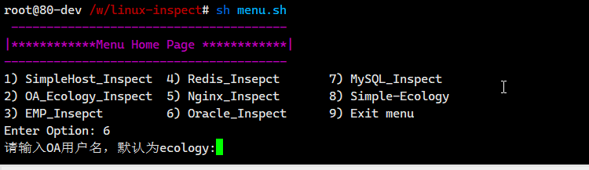

  ####  MySQL巡检

  1. 上传巡检脚本到MySQL服务器,任意位置(建议/tmp),创建巡检目录并解压
   
   `mkdir inspect && tar -zxvf Linux-inspect.tar.gz -C inspect && cd inspect`

  2. 执行`sh menu.sh`,选择`7`,执行MySQL巡检,输入`参数(账号,密码,主机,端口)`
  
  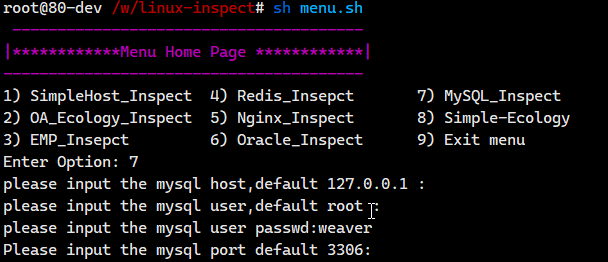

  #### Simple-Ecology巡检(适用于非resin中间件)

  1. 上传巡检脚本到OA服务器,任意位置(建议/tmp),创建巡检目录并解压
   
   `mkdir inspect && tar -zxvf Linux-inspect.tar.gz -C inspect && cd inspect`

  2. 执行`sh menu.sh`,选择`8`,执行OA巡检,输入`参数(ecology路径,jdk路径,oa端口)`
  
  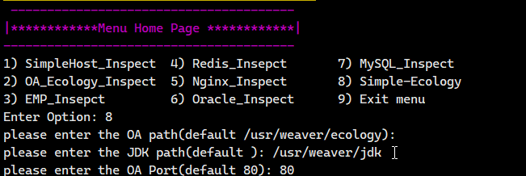

# 巡检项说明

## OA相关
1.	主机名到IP解析
2.	系统最大打开文件数
3.	JDK版本
4.	Resin版本
5.	Resin最大线程数
6.	Resin最大端口线程数
7.	Resin最大内存
8.	系统数据库最大连接数
9.	是否开启SQL缓存
10.	Redis连接状态
11.	是否开启Session共享
12.	是否配置系统搜索通过微搜
13.	resin进程数
14.	watchdog进程数
15.	oa系统版本
16.	oa系统使用者公司名称
17.	resin3配置savesession
18.	是否同一台主机安装了emobile服务
19.	是否同一台主机安装了Ebridge服务
20.	是否同一台主机安装了Esearch服务
21.	是否同一台主机安装了ElasticSearch服务
22.	是否配置UrlCharacter为UTF8
23.	JKD路径权限是否正确
24.	InitCache.properteis补丁包是否覆盖
25.	Nginx配置文件是否配置了clientmaxbodysize
26.	emobile服务是否配置了monitor监控
27.	web.xml过滤器顺序检测
28.	安全包状态检测
29.	windows上80端口是否被SQLServer或IIS占用
30.	NFS重复挂载
31.	Ecology日志大小
32.	Resin日志大小
33.	Ecode版本是否为最新
34.	部署时间是否超过100天
35.	Ecode消息中心是否升级到最新
36.	Redis session优化包是否部署
37.	MemMonitor.class是否去掉判断大于90%的逻辑
38. EM7tomcat未配置缓存大小
39. RequestFormBiz.java导致数据库锁
40. WFNodeMainManager.java事务导致数据库锁
41. LimitCurr限流包
42. LoginExtion E9防串号
43. 用户组织画像开启导致OA宕机


## Linux操作系统相关

### 系统基础
1.	系统类型
2.	发行版本
3.	内核
4.	主机名
5.	SELinux
6.	语言/编码 
7.	当前时间
8.	最后启动时间
9.	运行时间
10.	负载

### CPU相关
1.	物理CPU个数
2.	逻辑CPU个数
3.	每CPU核心数
4.	CPU型号
5.	CPU架构
6.	CPU 用户空间占用百分比
7.	CPU内核空间占用百分比
8.	CPU 空闲时间占用百分比
9.	CPU Iowait等待百分比
10.	CPU中断次数（包括软中断，硬中断）
11.	CPU上下文切换次数
12.	CPU任务队列长度

### 内存相关
1.	物理内存总量
2.	物理内存使用量
3.	物理内存空闲量
4.	物理内存共享使用量
5.	物理内存buff使用量
6.	物理内存cache使用量
7.	物理内存空闲量
8.	交换内存总量
9.	交换内存使用量
10.	交换内存空闲量
11.	交换内存共享使用量
12.	交换内存buff使用量
13.	交换内存cache使用量
14.	交换内存空闲量

### 磁盘相关
1.	Filesystem磁盘类型
2.	磁盘总量
3.	磁盘使用量
4.	磁盘空闲量
5.	磁盘占用百分比
6.	磁盘Inodes总量
7.	磁盘Inodes使用量
8.	磁盘Inodes空闲量
9.	每秒进行merge的读操作数目（rrqm/s）
10.	每秒进行merge的写操作数目(wrqm/s)
11.	每秒完成读I/O设备次数(r/s)
12.	每秒完成写I/O设备次数(w/s)
13.	每秒读扇区数(rsec/s)
14.	每秒写扇区数(wsec/s)
15.	每秒读K字节数(rkB/s)
16.	每秒写K字节数(wkB/s)
17.	平均每秒设备I/O操作的数据大小(avgrq-sz)
18.	平均I/O队列长度(avgqu-sz)
19.	平均每秒设备I/O操作等待时间(await)
20.	平均每次设备I/O操作的服务时间(svctm)
21.	1秒钟有百分之多少的时间用于I/O操作（%util）

### 网络相关
1.	网卡名
2.	IP
3.	掩码
4.	网关
5.	DNS
6.	每秒接收包的数量（rxpck/s）
7.	每秒发送包的数量（txpck/s） 
8.	每秒接收的数据量（rxKB/s） 
9.	每秒发送的数据量（txKB/s）
10.	错误网络包总数（errors）
11.	丢弃网络包总数（drop）
12.	端口监听检查
13.	监听端口总数
14.	建立连接总数
15.	TIME-WAIT连接总数

### 进程相关
1.	进程ID（PID）
2.	进程占用内存百分比
3.	进程占用物理内存总量
4.	进程执行的命令
5.	进程执行的用户
6.	进程优先级（PR）
7.	进程Nice值
8.	进程SHR
9.	进程状态
10.	进程占用CPU的时间

### 服务相关
1.	开机自启服务列表检查
2.	正在运行服务列表检查

### 三方自启动脚本检查

### 历史登录账户检查

### 计划任务检查

### 用户检查
1.	/etc/passwd最后修改时间
2.	特权用户检查
3.	用户列表检查
4.	空密码用户检查
5.	相同ID的用户检查

### 密码检查
1.	密码过期策略检查
2.	密码设置策略检查

### Sudoers检查

### 防火墙检查
1.	防火墙开启状态
2.	防火墙规则

### SSH检查
1.	服务状态
2.	SSH协议版本
3.	SSH信任主机
4.	是否允许root登录
5.	SSH公私钥

### Syslog检查
1.	服务状态
2.	服务配置

### SNMP检查

### NTP检查
1.	NTP配置文件检查
2.	NTP时间同步检查

### /etc/hosts检查
1.	主机名
2.	主机名到IP的映射检查

### 软件检查
1.	软件名
2.	软件安装时间

### 内核参数检查
1.	maxfiles(最大文件数)
2.	maxfiles_allocated(系统已占用文件数)
3.	maxproc（系统最多进程数）

## Windows操作系统相关
1.	主机名
2.	用户名
3.	当前登录session名称
4.	CPU厂商
5.	CPU名称
6.	CPU核数
7.	CPU占用率
8.	交换内存名称
9.	交换内存总量
10.	交换内存使用量
11.	交换内存使用百分比
12.	物理内存总量
13.	物理内存使用量
14.	物理内存空闲量
15.	物理内存使用百分比
16.	磁盘总数
17.	磁盘接口类型（SCSI，IDE）
18.	磁盘序列号
19.	磁盘状态
20.	磁盘使用率
21.	网卡名称
22.	网卡Mac地址
23.	网卡速率
24.	网卡IP，掩码，网关
25.	操作系统版本
26.	操作系统安装时间
27.	操作系统架构
28.	操作系统内核版本号
29.	操作系统时区


# 巡检修复建议

## 设置URL编码

1. 修改resin.conf或resin.xml
2. 在```<cluster id="app">```下新加```<url-character-encoding>utf-8</url-character-encoding>``` 如下图:


## Linux主机名解析
1. 使用 vi 编辑器打开 /etc/hosts 文件
   
    ```vi /etc/hosts```
2. 在文件尾部添加内容，格式：IP地址 主机名（中间用空格分隔），保存退出
   
   ``` 192.168.80.157 ecology```

## TIME-WAIT连接数

1. 设置nginx upstram 中keepalive 3000;
   
   ``` keepalive 3000; ```
2. 配置proxy_http_version 1.1; proxy_set_header Connection "";
   
   ``` 
      proxy_http_version 1.1;
      proxy_set_header Connection "";
   ```
3. 参考图片

   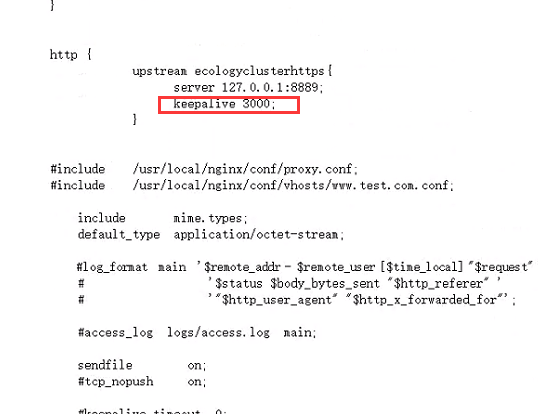
   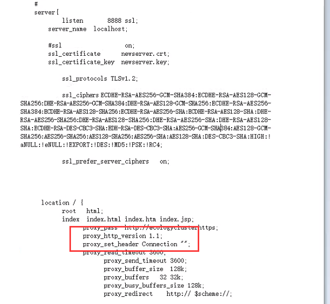
## Linux服务器配置虚拟内存

配置Linux虚拟内存,参考以下链接

 [Linux虚拟内存](https://blog.csdn.net/zstack_org/article/details/53258588)


## Windows服务器配置虚拟内存

① 鼠标右击【此电脑】图标，弹出菜单选择【属性】。


② 弹出系统窗口,点击左边子菜单【高级系统设置】。


③ 系统属性窗口点击【高级】子菜单，点击性能下的【设置】。


④ 在虚拟内存窗口中，首先取消自动管理所有驱动器的分页大小，点击最后一个分区F盘，选择自定义大小，初始大小和最大值都填入相同的数字，一般为物理内存x1024x2。如 物理内存8G,则设置为 8x1024x2为16384, 点击【设置】。


⑤ 已经设置了F盘的虚拟内存，就可以取消C盘的虚拟内存了，选择C盘，选择无分页文件，点击【设置】。


⑥ 提示分页文件小于800MB会发生系统错误，由于设置了F盘足够大的虚拟内存，可以忽略提示，点击【是】。


⑦ 可以看到所有盘符里只有F盘有分页文件，点击【确定】。


⑧ 重新启动服务器，再次看到F盘的空间有变化了，被占用的就是分页文件，也就是虚拟内存。


**本文部分图片来自https://blog.csdn.net/meigang2012/article/details/77505485**

## 禁用Resin热部署

<a href="assets/stophotdeploy.jar" target="_blank">stophotdeploy.jar</a>
### Resin4热部署补丁包操作

1、停OA服务

2、将附件stophotdeploy.jar 更新到生产Resin目录下。

3、修改Resin的配置文件resin.properties（相对路径 Resin/conf/resin.properties）

4、将resin.properties 内的jvm_args：参数内容上，加上  -javaagent:stophotdeploy.jar

例如：

   ``` jvm_args  : -javaagent:stophotdeploy.jar -Xmx5500m -Xms5500m -XX:ParallelGCThreads=20 -XX:+UseConcMarkSweepGC -XX:+UseParNewGC -XX:+DisableExplicitGC -javaagent:wagent.jar  ```
 
5、启动oa服务即可


### Resin3热部署补本包操作
1、停OA服务

2、将附件stophotdeploy.jar 更新到生产Resin目录下。

3、修改Resin的配置文件resin.conf（相对路径 Resin/conf/resin.conf）

4、在resin.conf 内的<jvm-arg>-XX:+DisableExplicitGC</jvm-arg>  下一行，加上 <jvm-arg>-javaagent:stophotdeploy.jar</jvm-arg>

例如：

      <jvm-arg>-XX:ParallelGCThreads=20</jvm-arg>
      <jvm-arg>-XX:+UseConcMarkSweepGC</jvm-arg>
      <jvm-arg>-XX:+UseParNewGC</jvm-arg>
      <jvm-arg>-XX:+DisableExplicitGC</jvm-arg>
	  <jvm-arg>-javaagent:stophotdeploy.jar</jvm-arg>
	  
5、启动oa服务即可

## EMP配置线程日志打印

1. 修改/usr/emp/appsvr/tomcat/webapps/ROOT/WEB-INF/web.xml添加以下serverlet
 ```
 <servlet> 
 <servlet-name>InitMonitor</servlet-name>
	<servlet-class>weaver.general.MonitorServer</servlet-class>
	<init-param>
		<param-name>serverName</param-name>
		<param-value>ecology</param-value>
	</init-param>
	<load-on-startup>2</load-on-startup>
</servlet>
```

2. 覆盖补丁包tomcat_EM7.zip即可

      <a href="assets/tomcat_EM7.zip" target="_blank">tomcat_EM7.zip</a>

## Linux系统打开文件数

命令行执行
```
   echo "* soft nofile 65535" >> /etc/security/limits.conf
   echo "* hard nofile 65535" >> /etc/security/limits.conf
```
退出重新登录,控制台执行`ulimit -a`查看是否生效


## 查找nginx.conf路径,修改nginx.conf配置文件

1. 获取nginx可执行文件路径```ps -aux |grep nginx```
   
   
   如果可执行文件为"./nginx",则需要通过命令查找exe的绝对路径,如
   

2. 使用第一步找到的nginx可执行为文件执行 ```/usr/sbin/nginx -t```,获取nginx配置文件,如下图:
   
   

3. 使用vi修改nginx配置文件,配置完成后使用```/usr/sbin/nginx -t```测试配置文件格式是否正确,如图:
   

4. 重载nginx配置文件,```/usr/sbin/nginx -s reload```,如图:
   
   

## NTP时间同步


1. 判断系统是否配置了ntp,执行命令```rpm -qa |grep ntp |wc -l```如果结果大于1,证明系统已安装ntpdate,如果结果为0证明未安装ntp,请使用命令```yum install -y ntpdate```
   
   

2. 配置NTP时间同步
   1.  使用命令```ping www.baidu.com```判断客户是否可以上外网,如果客户上外网,直接配置阿里云ntp时间同步
       
       
       
       ```crontab -e ```,按```i```键输入
       
       ```*/10 * * * * /usr/sbin/ntpdate ntp.aliyun.com```

       
   2. 如果不能上外网,询问客户是否内部有时间同步服务器,如果有,则配置内部NTP服务器,如果没有,放弃ntp时间同步
      
      ```crontab -e ```,按```i```键输入,请替换下面IP 10.10.25.25为客户内部NTP时间同步服务器
      
       ```*/10 * * * * /usr/sbin/ntpdate 10.10.25.25```

## Resin XMX内存

1. Resin配置文件
   
        Resin4 配置文件resin.properties（相对路径 Resin/conf/resin.properties）

        Resin3 配置文件resin.conf（相对路径 Resin/conf/resin.conf）

2. 修改XMX内存,系统内存小于8G,配置3550,大于8G小于16G,配置5550,大于16G配置8550,如下图:
 
   


## SQL缓存

修改配置文件ecology/WEB-INF/prop/initCache.properties,设置iscache=1,如下图:


## DocSearch

修改配置文件ecology/WEB-INF/prop/doc_full_search.properties配置文件，配置use_full_search=1 default_treenode=1,如下图:


## 安全包状态（升级最新安全包）

参考链接:

[ecology安全包下载地址](https://www.weaver.com.cn/cs/securityDownload.html#)

[ecology安全包配置说明](https://www.e-cology.com.cn/spa/document/index.jsp?imagefileId=11804323&id=6589629&router=1#/main/document/detail?_key=zlt82l)

## Ecode版本

升级Ecode至最新版本
[Ecode下载地址](https://e-cloudstore.com/files/ecology_dev.zip)
## Redis优化

升级redis优化包
<a href="assets/redis session优化.zip" target="_blank">redis session优化.zip</a>

## MemMonitor优化

提交流程至性能组同事出包解决,修改ecology/src/weaver/monitor/monitor/MemMonitor.java


## E9限流包

升级E9限流包
[限流包](https://home.sunzhe.cc:89/d/应用限流最终版.zip)

## E9防串号

升级E9防串号补丁包
[防串号](https://home.sunzhe.cc:89/d/e9防超时及串号最终版final.zip)

## E9用户组织画像

如果未启用非标组织画像菜单，请在后台管理页面禁用如下计划任务
[组织画像启用关闭SQL](https://home.sunzhe.cc:89/d/E9组织画像计划任务处理.rar)

## E9Redis大key

`请确保已经更新过Redis优化包`
升级Redis大key补丁包
[Redis大key补丁包](https://home.sunzhe.cc:89/d/解决大key以及耗性能key优化包ecology.zip)

## Tomcat资源缓存

修改`/usr/emp/appsvr/tomcat/conf/context.xml`


## Linux 虚拟内存配置（内核参数）

1. 修改配置文件 `/etc/sysctl.conf`中`vm.swappiness=30`

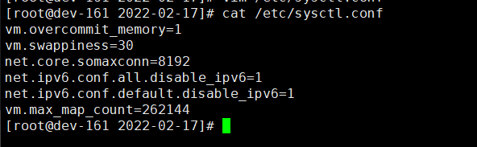

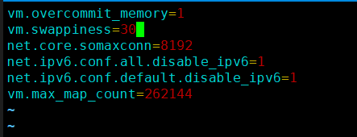

2. 命令行执行`sysctl -p`使配置生效

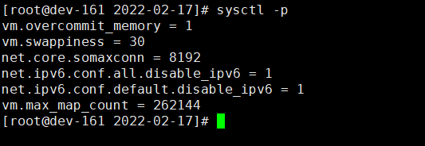


## Linux TCP 重用配置

   `当net.ipv4.tcp_tw_reuse设置为1时，会导致网络连接被拒绝`

1. 修改配置文件 `/etc/sysctl.conf`中`net.ipv4.tcp_tw_reuse=0`

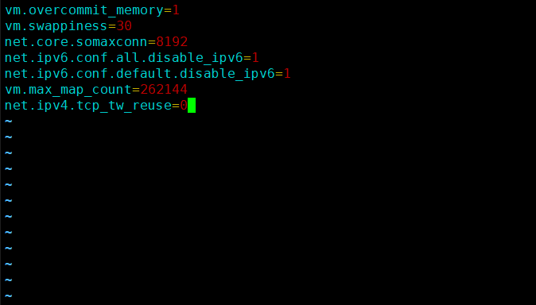

2. 命令行执行`sysctl -p`使配置生效

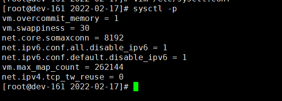

## Linux TCP 快速回收

   `当net.ipv4.tcp_tw_recycle设置为1时，会导致网络连接被拒绝`

1. 修改配置文件 `/etc/sysctl.conf`中`net.ipv4.tcp_tw_recycle=0`

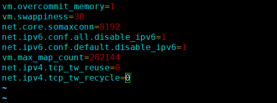

2. 命令行执行`sysctl -p`使配置生效

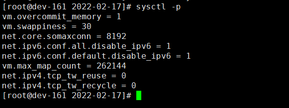