# 巡检问题修复

> An awesome project.

# 设置URL编码
1. 修改resin.conf或resin.xml
2. 在```<cluster id="app">```下新加```<url-character-encoding>utf-8</url-character-encoding>``` 如下图:
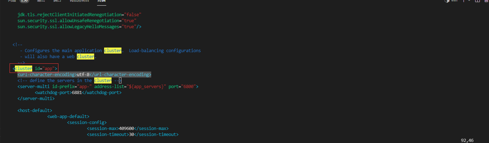


# Linux主机名解析
1. 使用 vi 编辑器打开 /etc/hosts 文件
   
    ```vi /etc/hosts```
2. 在文件尾部添加内容，格式：IP地址 主机名（中间用空格分隔），保存退出
   
   ``` 192.168.80.157 ecology```

# TIME-WAIT连接数

1. 设置nginx upstram 中keepalive 300;
   
   ``` keepalive 3000; ```
2. 配置proxy_http_version 1.1; proxy_set_header Connection "Keep-Alive";
   
   ``` 
      proxy_http_version 1.1;
      proxy_set_header Connection "Keep-Alive";
   ```
3. 参考图片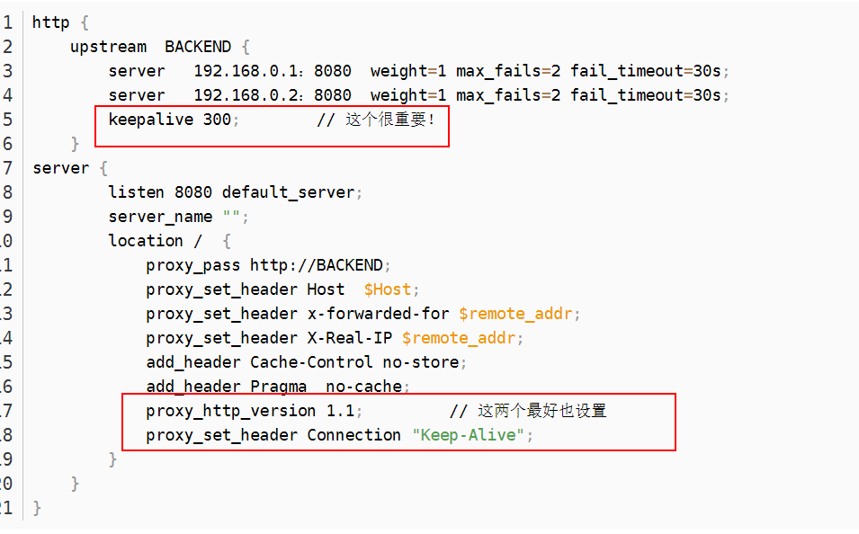

# Linux服务器配置虚拟内存

配置Linux虚拟内存,参考以下链接

 [Linux虚拟内存](https://blog.csdn.net/zstack_org/article/details/53258588)


# Windows服务器配置虚拟内存

① 鼠标右击【此电脑】图标，弹出菜单选择【属性】。

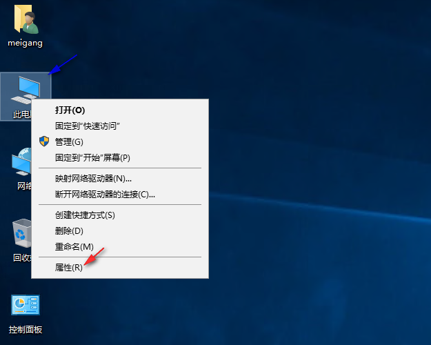

② 弹出系统窗口,点击左边子菜单【高级系统设置】。

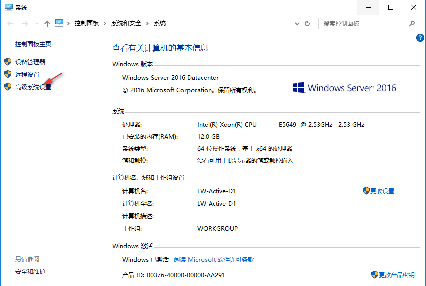

③ 系统属性窗口点击【高级】子菜单，点击性能下的【设置】。

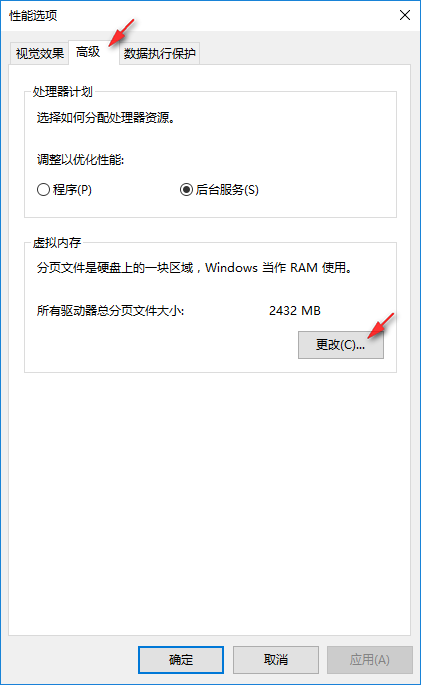

④ 在虚拟内存窗口中，首先取消自动管理所有驱动器的分页大小，点击最后一个分区F盘，选择自定义大小，初始大小和最大值都填入相同的数字，一般为物理内存x1024x2。如 物理内存8G,则设置为 8x1024x2为16384, 点击【设置】。

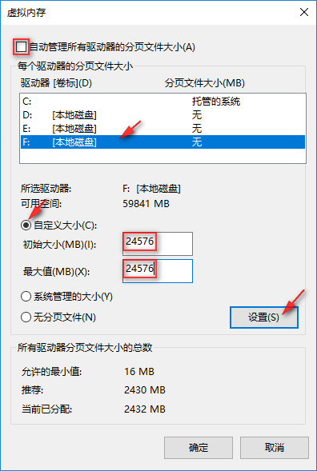

⑤ 已经设置了F盘的虚拟内存，就可以取消C盘的虚拟内存了，选择C盘，选择无分页文件，点击【设置】。


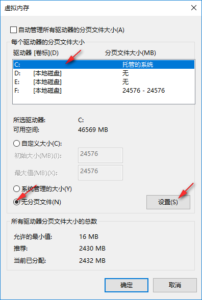

⑥ 提示分页文件小于800MB会发生系统错误，由于设置了F盘足够大的虚拟内存，可以忽略提示，点击【是】。

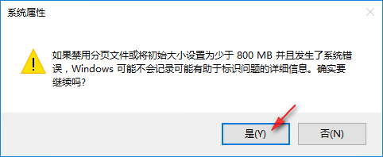

⑦ 可以看到所有盘符里只有F盘有分页文件，点击【确定】。

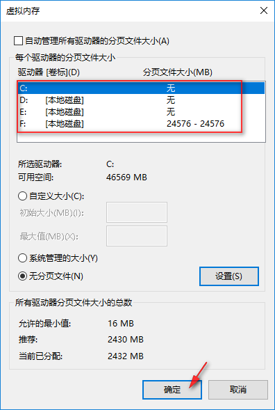

⑧ 重新启动服务器，再次看到F盘的空间有变化了，被占用的就是分页文件，也就是虚拟内存。

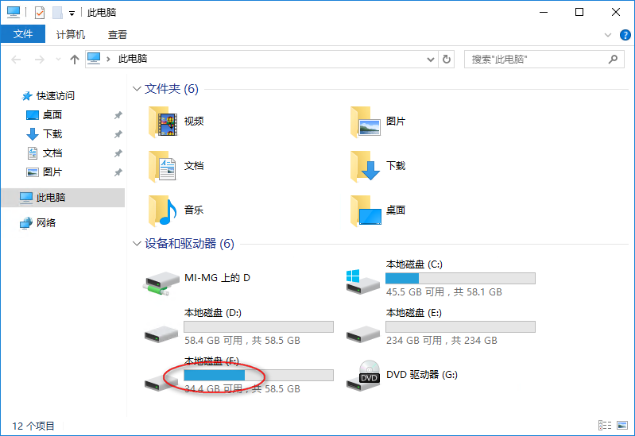

**本文部分图片来自https://blog.csdn.net/meigang2012/article/details/77505485**

# 禁用Resin热部署

<a href="assets/stophotdeploy.jar" target="_blank">stophotdeploy.jar</a>
## Resin4热部署补丁包操作

1、停OA服务

2、将附件stophotdeploy.jar 更新到生产Resin目录下。

3、修改Resin的配置文件resin.properties（相对路径 Resin/conf/resin.properties）

4、将resin.properties 内的jvm_args：参数内容上，加上  -javaagent:stophotdeploy.jar

例如：

   ``` jvm_args  : -javaagent:stophotdeploy.jar -Xmx5500m -Xms5500m -XX:ParallelGCThreads=20 -XX:+UseConcMarkSweepGC -XX:+UseParNewGC -XX:+DisableExplicitGC -javaagent:wagent.jar  ```
 
5、启动oa服务即可


## Resin3热部署补本包操作
1、停OA服务

2、将附件stophotdeploy.jar 更新到生产Resin目录下。

3、修改Resin的配置文件resin.conf（相对路径 Resin/conf/resin.conf）

4、在resin.conf 内的<jvm-arg>-XX:+DisableExplicitGC</jvm-arg>  下一行，加上 <jvm-arg>-javaagent:stophotdeploy.jar</jvm-arg>

例如：

      <jvm-arg>-XX:ParallelGCThreads=20</jvm-arg>
      <jvm-arg>-XX:+UseConcMarkSweepGC</jvm-arg>
      <jvm-arg>-XX:+UseParNewGC</jvm-arg>
      <jvm-arg>-XX:+DisableExplicitGC</jvm-arg>
	  <jvm-arg>-javaagent:stophotdeploy.jar</jvm-arg>
	  
5、启动oa服务即可

# EMP配置线程日志打印

1. 修改/usr/emp/appsvr/tomcat/webapps/ROOT/WEB-INF/web.xml添加以下serverlet
 ```
 <servlet> 
 <servlet-name>InitMonitor</servlet-name>
	<servlet-class>weaver.general.MonitorServer</servlet-class>
	<init-param>
		<param-name>serverName</param-name>
		<param-value>ecology</param-value>
	</init-param>
	<load-on-startup>2</load-on-startup>
</servlet>
```

2. 覆盖补丁包tomcat_EM7.zip即可

      <a href="assets/tomcat_EM7.zip" target="_blank">tomcat_EM7.zip</a>

# Linux系统打开文件数

命令行执行
```
   echo "* soft nofile 65535" >> /etc/security/limits.conf
   echo "* hard nofile 65535" >> /etc/security/limits.conf
```
退出重新登录,控制台执行`ulimit -a`查看是否生效

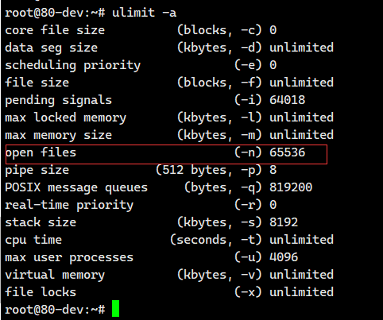


# 查找nginx.conf路径,修改nginx.conf配置文件

1. 获取nginx可执行文件路径```ps -aux |grep nginx```
   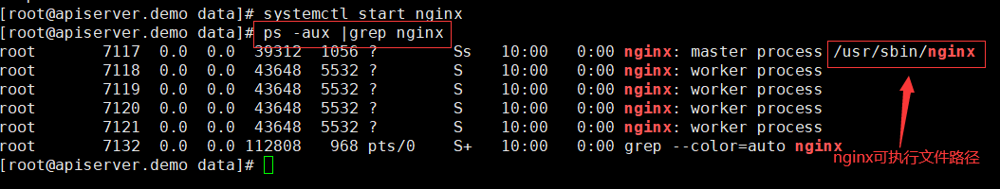
   
   如果可执行文件为"./nginx",则需要通过命令查找exe的绝对路径,如
   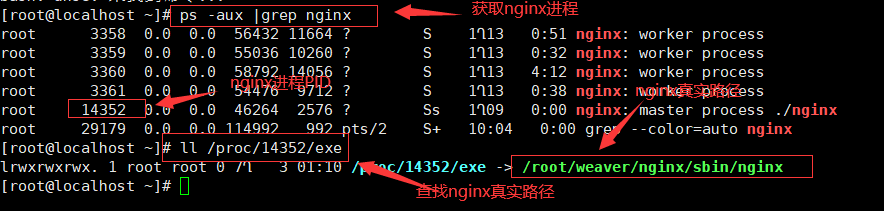

2. 使用第一步找到的nginx可执行为文件执行 ```/usr/sbin/nginx -t```,获取nginx配置文件,如下图:
   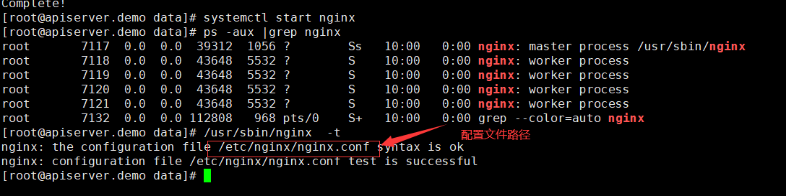
   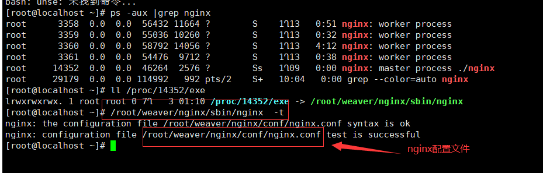

3. 使用vi修改nginx配置文件,配置完成后使用```/usr/sbin/nginx -t```测试配置文件格式是否正确,如图:
   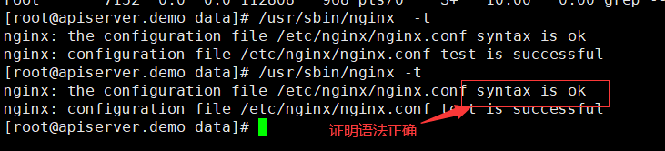

4. 重载nginx配置文件,```/usr/sbin/nginx -s reload```,如图:
   
   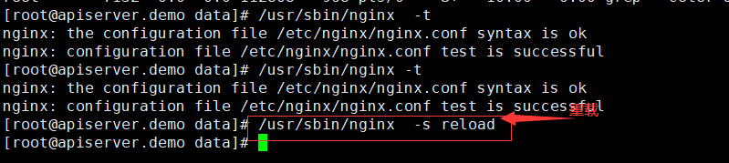

# NTP时间同步


1. 判断系统是否配置了ntp,执行命令```rpm -qa |grep ntp |wc -l```如果结果大于1,证明系统已安装ntpdate,如果结果为0证明未安装ntp,请使用命令```yum install -y ntpdate```
   
   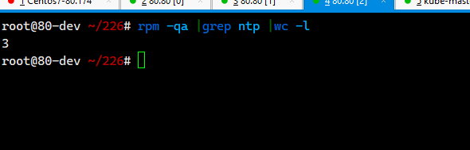

2. 配置NTP时间同步
   1.  使用命令```ping www.baidu.com```判断客户是否可以上外网,如果客户上外网,直接配置阿里云ntp时间同步
       
       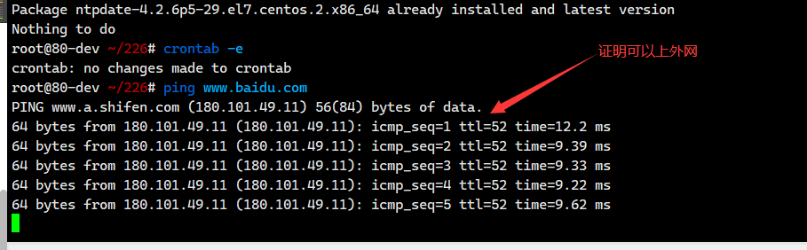
       
       ```crontab -e ```,按```i```键输入
       
       ```*/10 * * * * /usr/sbin/ntpdate ntp.aliyun.com```

       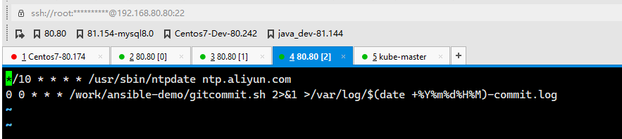
   2. 如果不能上外网,询问客户是否内部有时间同步服务器,如果有,则配置内部NTP服务器,如果没有,放弃ntp时间同步
      
      ```crontab -e ```,按```i```键输入,请替换下面IP 10.10.25.25为客户内部NTP时间同步服务器
      
       ```*/10 * * * * /usr/sbin/ntpdate 10.10.25.25```

# Resin XMX内存

1. Resin配置文件
   
        Resin4 配置文件resin.properties（相对路径 Resin/conf/resin.properties）

        Resin3 配置文件resin.conf（相对路径 Resin/conf/resin.conf）

2. 修改XMX内存,系统内存小于8G,配置3550,大于8G小于16G,配置5550,大于16G配置8550,如下图:
 
   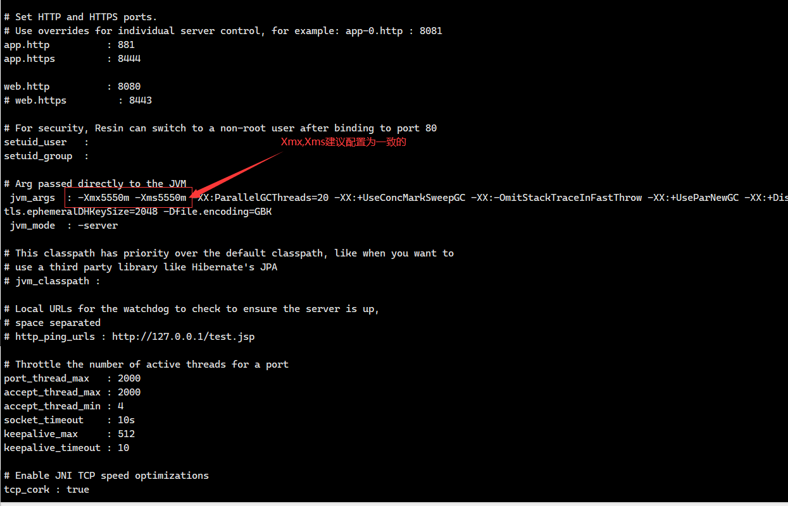


# SQL缓存

修改配置文件ecology/WEB-INF/prop/initCache.properties,设置iscache=1,如下图:

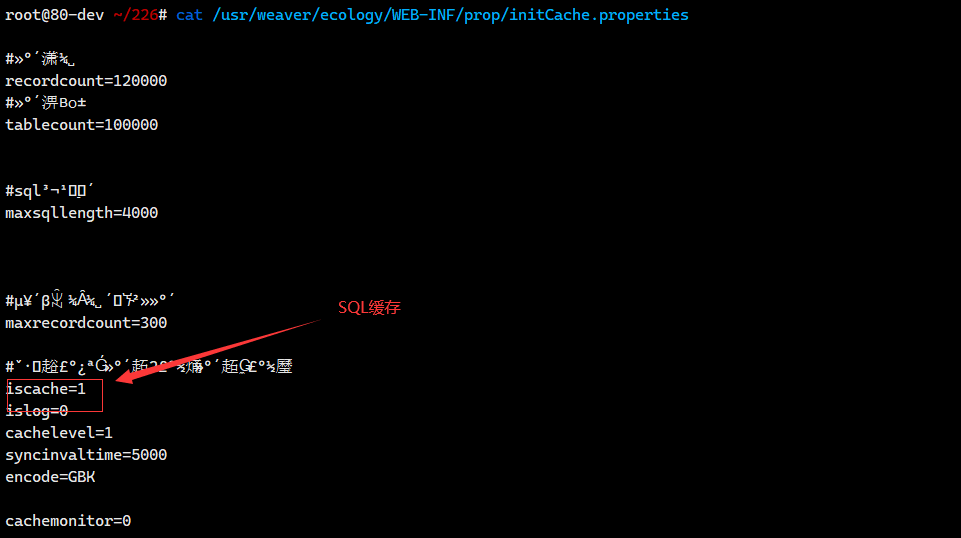


# DocSearch

修改配置文件ecology/WEB-INF/prop/doc_full_search.properties配置文件，配置use_full_search=1 default_treenode=1,如下图:

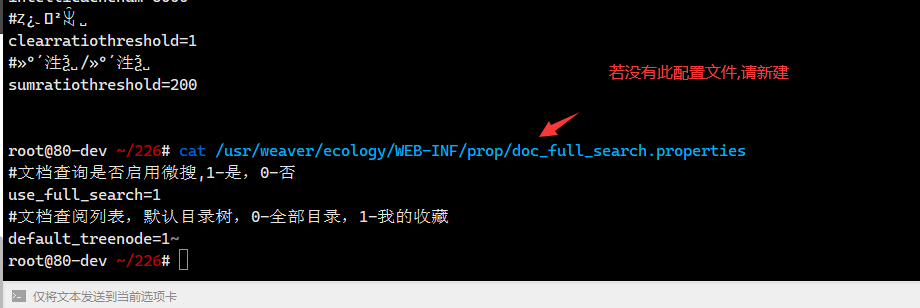

# 安全包自动更新

参考链接:

[ecology安全包下载地址](https://www.weaver.com.cn/cs/securityDownload.html#)

[ecology安全包配置说明](https://www.e-cology.com.cn/spa/document/index.jsp?imagefileId=11804323&id=6589629&router=1#/main/document/detail?_key=zlt82l)

# Ecode版本

升级Ecode至最新版本
[Ecode下载地址](https://e-cloudstore.com/files/ecology_dev.zip)
# Redis优化

升级redis优化包
<a href="assets/redis session优化.zip" target="_blank">redis session优化.zip</a>

# MemMonitor优化

提交流程至性能组同事出包解决,修改ecology/src/weaver/monitor/monitor/MemMonitor.java
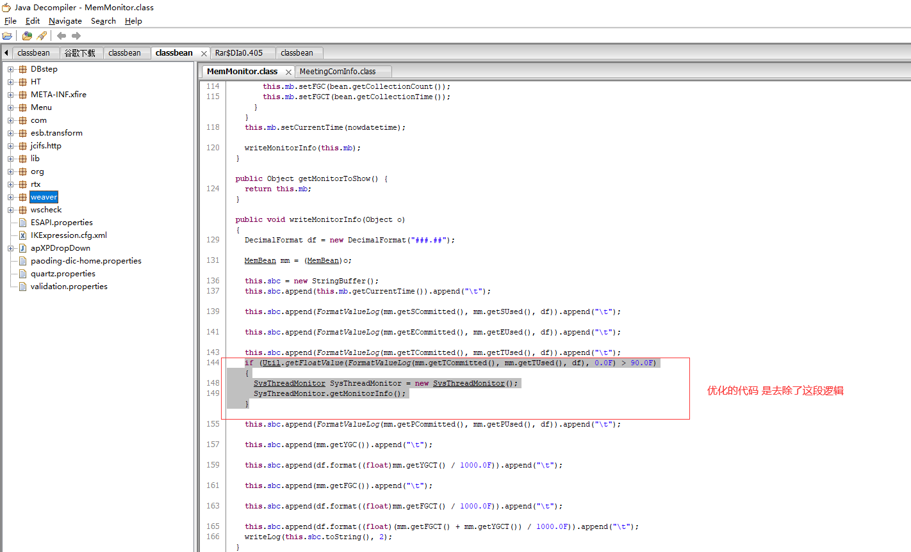
